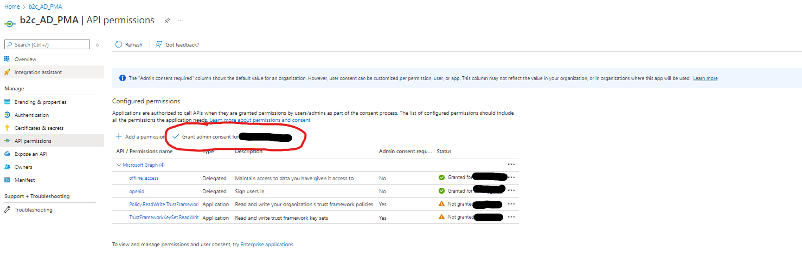
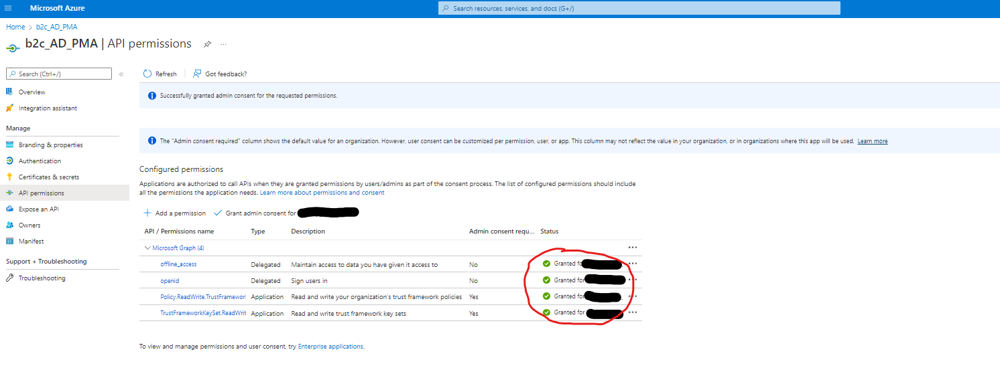

# B2C Cleanup User Docs

## Prerequisites

* You should have already created on Azure:
  * 1x AD tenant
  * 1x B2C tenant

## Starting The Script

* Load Learn-LTI/Deployment into Windows File Explorer
* **Hold shift** and right click in the file explorer to launch the Expanded Context Menu

|  |
|---|
|  Click "Open Powershell Window Here" to launch powershell with cd already set to Learn-Lti/Deployment  |

* Type ".\B2CCleanup.ps1" into the newly launched Powershell then press enter 
  * 
(base) PS D:\Users\Username\Documents\Learn-LTI\deployment> .\B2CDeployment.ps1

## Step 0:

* You will immediately be prompted to input the name of the B2C and AD tenants you have created:   1. First, input the name of the B2C Tenant you have created  2. Next, input the name of the Azure AD Tenant you have created
  * 
Please enter your B2C tenant name: ******** Please enter your AD tenant name: ********div>

## Step 1: Create AD application

### Login to AD Tenant via your browser

* Your powershell will now prompt you that a pop-up window has launched in your browser and directing you to log in to your AD tenant through it
    * 
============================================================ STEP 1: Create AD application ============================================================= Please login to ******** via the pop-up window that has launched in your browser

|  |
|---|
| The launched tab should look similar to the above; please login using it and then switch back to the powershell |

### Creating the app and its secret

* Return to your powershell Window, and you will now be prompted to give names for: 1. The AD Application to be created 2. The AD Applications Secret to be created We suggest using a sensible name, such as "b2c_AD_app" and "b2c_AD_app_secret"
    * 
============================================================ STEP 1: Create AD application ============================================================= Please login to ******** via the pop-up window that has launched in your browser Please give a name for the AD application to be created: b2c_AD_app Creating the client secret for b2c_AD_app Please give a name for the client secret to be created: b2c_AD_app_secret

### Recording the secret value (important)
* Upon successfully creating the app and its secret; the script will now output some important values in green and then pause until you next press Enter.  It is strongly recommended now that you take a moment to **store somewhere safe the ID of the app and the value for the secret** that has just been created for it; as this **secret value will no longer be accessible again**. After recording these values press enter to continue with the script.
    * 
============================================================ STEP 1: Create AD application ============================================================= Please login to ******** via the pop-up window that has launched in your browser Please give a name for the AD application to be created: b2c_AD_app Creating the client secret for b2c_AD_app Please give a name for the client secret to be created: b2c_AD_app_secret Client ID for b2c_AD_app: ******** Please take a moment to make a note of and protect the following client secret; as you will not be able to access it again. Client secret for b2c_AD_app: ******** Press enter when ready to continue after recording the client secret:

## Step 2: Logging into the B2C tenant via your browser

* Your powershell will now prompt you that a pop-up window has launched in your browser and directing you to login to your B2C tenant through it
    * 
============================================================ STEP 2: Logging into the B2C Tenant ============================================================= Please login to ******** via the pop-up window that has launched in your browser

|  |
|---|
| The launched tab should look similar to the above; please login using it and then switch back to the powershell |

## Step 3: Creating the B2C Web Application

### Creating the webapp and its secret

* Return to your powershell Window, and you will now be prompted to give names for: 1. The B2C Web Application to be created 2. The B2C Web Applications Secret to be created We suggest using a sensible name, such as "b2c_AD_webapp" and "b2c_AD_webapp_secret"
    * 
============================================================ STEP 3: Creating the B2C Web Application ============================================================= Please give a name for the web application to be created: b2c_AD_webapp Creating the client secret for b2c_AD_app Please give a name for the client secret to be created: b2c_AD_webapp_secret

### Recording the secret value (important)

* Upon successfully creating the webapp and its secret; the script will now output some important values in green and then pause until you next press Enter.  It is strongly recommended now that you take a moment to **store somewhere safe the ID of the app and the value for the secret** that has just been created for it; as this **secret value will no longer be accessible again**. After recording these values press enter to continue with the script.
    * 
============================================================ STEP 1: Create AD application ============================================================= Please give a name for the web application to be created: b2c_AD_webapp Creating the client secret for b2c_AD_webapp Please give a name for the client secret to be created: b2c_AD_webapp_secret Client ID for b2c_AD_webapp: ******** Please take a moment to make a note of and protect the following client secret; as you will not be able to access it again. Client secret for b2c_AD_webapp: ******** Press enter when ready to continue after recording the client secret:

## Steps 4 & 5: Creating the Identity Experience Framework & Proxy Identity Experience Framework Applications

* No user input is required in these steps; simply wait for them to finish

## Step 6: Creating Permission Management Application

### Creating the Permission Management Application and its secret

* Return to your powershell Window, and you will now be prompted to give names for: 1. The B2C Permission Management Application to be created 2. The 2C Permission Management Applications Secret to be created We suggest using a sensible name, such as "b2c_AD_PMA" and "b2c_AD_PMA_secret"
    * 
============================================================ STEP 6: Creating Permission Management Application ============================================================= Please give a name for the permission management application to be created: b2c_AD_PMA Creating the client secret for b2c_AD_app Please give a name for the client secret to be created: b2c_AD_PMA_secret

### Recording the secret value (important)

* Upon successfully creating the permission management app and its secret; the script will now output some important values in green and then pause until you next press Enter.  It is strongly recommended now that you take a moment to **store somewhere safe the ID of the app and the value for the secret** that has just been created for it; as this **secret value will no longer be accessible again**. After recording these values press enter to continue with the script.
    * 
============================================================ STEP 6: Creating Permission Management Application ============================================================= Please give a name for the permission management application to be created: b2c_AD_PMA Creating the client secret for b2c_AD_app Please give a name for the client secret to be created: b2c_AD_PMA_secret Client ID for b2c_AD_PMA: ******** Please take a moment to make a note of and protect the following client secret; as you will not be able to access it again. Client secret for b2c_AD_PMA: ******** Press enter when ready to continue after recording the client secret:

## Step 7: (Optional) linking facebook app

### Don't link Facebook App

* If you do not have a facebook application to link, simply input 'n' when prompted to skip this step
    * 
============================================================ STEP 7: (Optional) linking facebook appApplication ============================================================= Do you have a facebook application set up that you'd like to link? (y/n): n

### Link Facebook App

* If you do have a facebook application to link, input 'y' when prompted then input the ID of the Facebook application you would like to lin
    * 
============================================================ STEP 7: (Optional) linking facebook appApplication ============================================================= Do you have a facebook application set up that you'd like to link? (y/n): y What is the application ID of the Facebook application you created?: ******** 

## Step 8 & 9: Creating and Generating Custom Policies from templates

* No user input is required in these steps; simply wait for them to finish

## Step 10: Adding Signing and Encryption keys and AADAppSecret for the IEF Applications

### Input key duration
* You will first be prompted to input how long you wish the created keys to be valid for before they expire
    * 
============================================================ STEP 10: Adding signing and encryption keys and AADAppSecret for the IEF applications ============================================================= How many months do you want the keys to be valid for? (must be greater than 0): 3

* Upon success, the keysets and their respective keys will automatically be generated and/or uploaded in the subsequent steps 10.a through 10.c.

#### Troubleshoot PMA Admin Consent

* This step may fail due to a race condition between the granting of admin-consent vs the requirement of its usage in this step; you will know this has occured if you see the error message shown below
    * 
Error due to admin-consent having not yet been granted; please copy and paste the yellow link into your browser to manually grant admin-consent then press enter. https://portal.azure.com/#view/Microsoft_AAD_RegisteredApps/ApplicationMenuBlade/~/CallAnAPI/appId/{{YOUR APP ID}}/isMSAApp~/false Please check the markdown https://github.com/UCL-MSc-Learn-LTI/Learn-LTI/deployment/B2C_Docs/B2C_Deployment.md if you require assistance on how to do this. Press enter after manually granting the admin consent permission:

* To solve this issue, follow the link highlighted yellow in your console which will take you to the below page. On this page you should see a button called "Grant admin consent for {B2C Tenant Name} circled in red.
    * 
* After clicking on "Grant Admin Consent" the page should now say all permissions are granted
    * 
* Now simply return to the script and press enter
    * The script should then continue without requiring any further user inputs

## Step 11: Creating the AADAppSecret Key

* No user input is required in this step; simply wait for it to finish
* Upon this steps completion the B2C setup is now complete and can be configured with Learn-LTI

# Important note: Keep the generated AppInfo.csv safe
* This contains the ID's of the created applications as well as the tenants they belong to; this is required by B2CCleanup.ps1 if you wish to automatically clean up the script at a later date you will need this file (or else you must manually delete those applications)

# Trouble shooting
* [STEP 10: Error when getting the list of all custom policies in the tenant ](#troubleshoot-pma-admin-consent)